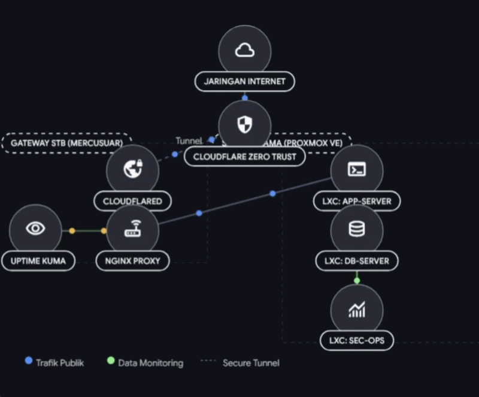
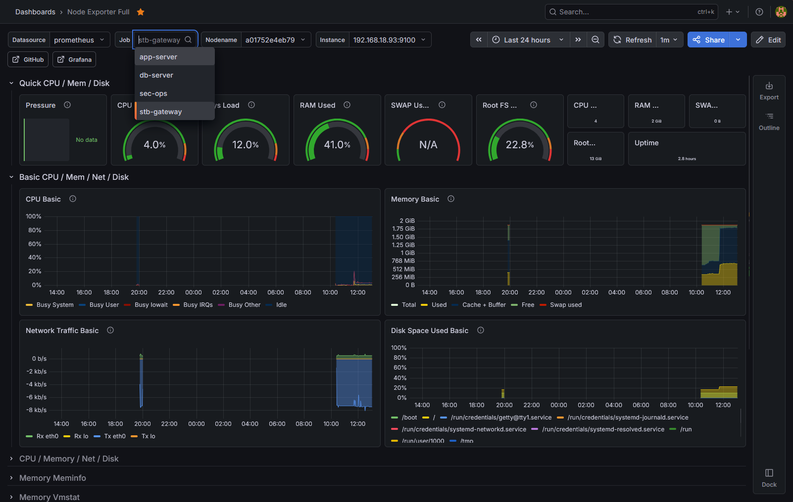
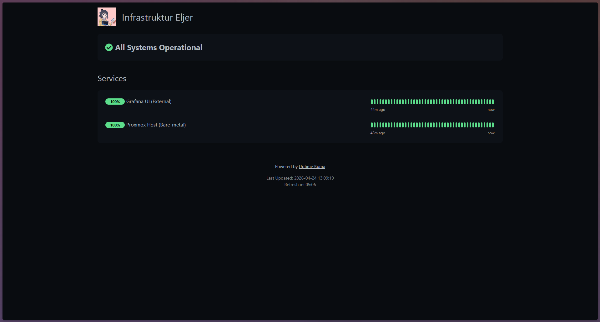

# Homelab Infrastructure & Micro-Segmented Gateway

## 📌 Executive Summary
This project is a comprehensive portfolio demonstrating the design and implementation of a scalable, micro-segmented homelab infrastructure. The architecture focuses on high availability, strict security measures, zero-trust network access, and efficient power consumption. It utilizes an Amlogic Single-Board Computer (AKARI AX810) as an edge gateway and a Proxmox VE server for application hosting.

## 📁 Infrastructure Components (Servers)
The infrastructure is divided into four main servers/components, each with its own specific role. The configuration and documentation for each can be found in their respective directories (managed via sparse-checkout on the actual servers):

1. **[gateway-stb](./gateway-stb/) (`stb`)**
   - **Role:** Edge Gateway & Reverse Proxy
   - **Hardware:** AKARI AX810 (Amlogic S905X4)
   - **Path on Server:** `/home/<user>/gateway-stb`
   - **Description:** Operates 24/7 with a low power footprint. Handles all incoming external traffic via Cloudflare Zero Trust and acts as a reverse proxy using Nginx.

2. **[node-apps](./node-apps/) (`app-server`)**
   - **Role:** Application Server
   - **Environment:** Proxmox LXC
   - **Path on Server:** `/opt/apps/node-apps`
   - **Description:** Hosts the main applications and workloads. Isolated to ensure other services remain unaffected by application-level issues.

3. **[db-server](./db-server/) (`db-server`)**
   - **Role:** Database Server
   - **Environment:** Proxmox LXC
   - **Path on Server:** `/opt/apps/db-server`
   - **Description:** Designed specifically for database hosting. Segregated to ensure data security and optimized performance.

4. **[monitoring-secops](./monitoring-secops/) (`sec-ops`)**
   - **Role:** Monitoring & Security Operations
   - **Environment:** Proxmox LXC
   - **Path on Server:** `/opt/apps/monitoring-secops`
   - **Description:** Centralized observability stack for tracking hardware metrics, container performance, and application uptime.

## 🏗️ Architecture Diagram
The physical and network topology is designed for security isolation and power efficiency.

> **Traffic Flow:** `Internet` ➔ `Cloudflare Tunnel` ➔ `STB (Nginx Reverse Proxy)` ➔ `Proxmox LXC (Internal IP)`



## 🛠️ Tech Stack
* **Virtualization & OS:** Proxmox VE, LXC, Ubuntu Server, Debian 11.
* **Networking & Security:** Cloudflare Zero Trust (Tunnels), Nginx, UFW (Uncomplicated Firewall), SSH RSA/Ed25519 Keys.
* **Containerization:** Docker, Docker Compose.
* **Observability:** Prometheus, Grafana, cAdvisor, Node Exporter, Uptime Kuma.
* **Automation & CI/CD:** Git sparse-checkout, GitHub Actions (Planned).

## 🔄 Pipeline Flow
Our deployment and CI/CD pipeline ensures automated, reliable updates across the micro-segmented infrastructure:

1. **Code Commit:** Infrastructure configurations and code changes are pushed to this GitHub repository.
2. **CI Validation:** Automated workflows check for syntax errors and validate Docker Compose files.
3. **Deployment Strategy:** 
   - Each target node uses `git sparse-checkout` to pull only the relevant directory (e.g., the database server only pulls the `db-server/` folder).
   - Updates are pulled into the respective paths (`/opt/apps/` or `/home/user/`).
4. **Service Orchestration:** `docker-compose` pulls the latest container images and orchestrates the running services on each node.
5. **Observability Loop:** Newly deployed containers are automatically detected by cAdvisor and Prometheus for real-time metric tracking.

## 🚀 How to Run/Deploy
To replicate or deploy updates to this infrastructure:

1. **Prerequisites:**
   - Proxmox VE installed for LXC hosting.
   - Amlogic SBC (or standard Linux box) configured with Debian/Ubuntu.
   - Cloudflare account for Zero Trust tunnels.
2. **Repository Setup (Sparse-Checkout on Node):**
   ```bash
   # Clone the repository using sparse-checkout to save space and isolate context
   git clone --filter=blob:none <repo-url> homelab-infrastructure
   cd homelab-infrastructure
   
   # For the DB server as an example:
   git sparse-checkout set db-server
   ```
3. **Deploying Services:**
   Navigate to the target directory and run Docker Compose:
   ```bash
   cd db-server  # or node-apps, gateway-stb, etc.
   docker-compose up -d
   ```
4. **Network Configuration:**
   Ensure UFW rules allow traffic only from the reverse proxy (STB) to the LXC nodes. Update Cloudflare tunnels to point to the STB's Nginx configuration.

## 🔒 Security Posture & Hardening
* **Zero-Trust Network Access:** Port forwarding is strictly disabled on the ISP router. All public access is securely tunneled via Cloudflared.
* **Access Control:** Root login over SSH is disabled across all nodes. Authentication is strictly enforced using Asymmetric SSH Keys.
* **Micro-segmentation:** Workloads are isolated in dedicated LXC instances with internal firewall rules allowing only necessary internal port communication.

## 📊 Observability & Dashboards
A centralized monitoring approach tracks both hardware and containerized environments:
* **Uptime Kuma:** Hosted on the Edge Gateway (SBC) to provide a 24/7 public status page.
* **Prometheus & Grafana:** Hosted on the isolated `sec-ops` LXC.
* **Node Exporter & cAdvisor:** Gather physical host metrics and real-time resource usage of Docker containers.

### Dashboards
**Grafana Resource Monitoring:**


**Uptime Kuma Status Page:**


## 🗺️ Future Roadmap
- [ ] Implement Automated Database Backup to secure cloud storage.
- [ ] Transition configurations to Infrastructure as Code (IaC) using Terraform or Ansible for fully reproducible environments.
